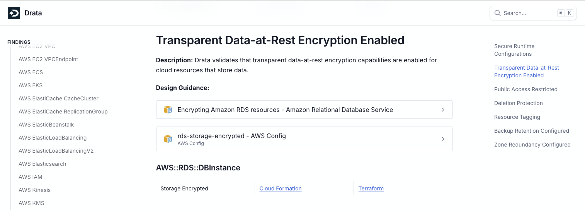

# TerraFail: A Tale of What Not to Do

## Welcome to TerraFail!

TerraFail is an insecure by design Infrastructure as Code (IaC) repository developed by security experts at [Drata](https://www.drata.com). This repository is packed full of deployable code templates that can be used to spin up a variety of applications across any of the 3 major cloud providers: AWS, Azure, and Google Cloud.

## Table of Contents

- [TerraFail: A Tale of What Not to Do](#terrafail-a-tale-of-what-not-to-do)
  - [Welcome to TerraFail!](#welcome-to-terrafail)
  - [Table of Contents](#table-of-contents)
  - [Introduction](#introduction)
  - [Getting Started](#getting-started)
  - [Leveling Up](#leveling-up)
  - [Setting up Code Review Pro](#setting-up-code-review-pro)
  - [Documentation](#documentation)

## Introduction

The purpose of this repository is to tell a tale of poor security posture while showcasing the impact Drata's powerful Compliance as Code capabilities have in catching common IaC misconfigurations before they hit production. Whether you're a developer, a security professional, or just someone with a keen interest in cloud security, this repository is your playground for learning about the pitfalls to avoid in IaC!

_Before proceeding, please read the following disclaimer:_

> [!CAUTION]
> TerraFail contains multiple examples of common IaC misconfigurations. These were developed with the intention of showcasing the impact of Drata's Compliance as Code engine on improving organizational security posture. Use at your own discretion; Drata is not responsible for any damages.

**Please use caution when using this codebase and ensure that you have appropriate permissions to deploy resources in your cloud environment. Always follow best practices for securing your cloud infrastructure and consult with your organization's security team before deploying any code to live environments.**

## Getting Started

Ready to see Compliance as Code in action? Here’s how you can get started with TerraFail using your Drata account:

1. **Fork a copy of the TerraFail repository into your github org**

   

2. **Login to Drata and create a new GitHub Code connection**

   

3. **Connect your GitHub account**

   

4. **Configure the list of repositories Drata will be able to access. Select TerraFail from the dropdown and click install**

   

5. **Navigate to repository settings to enable Compliance as Code scanning for your IaC**

   

6. **Select TerraFail from your repository list, switch the enable scanning toggle on and click save**

   

7. **Navigate to the Code tab on the Monitoring page and hit 'Test Now' on any Compliance as Code test**

   

8. **And it's that easy! Scroll down to view the latest test results and compliance recommendations for your IaC**

   

## Leveling Up

Now that you're painfully aware of all the compliance gaps in your infrastructure, you're probably wondering what comes next. Hours of research and investigation to understand these results and eventually fix them in your environment? What if I told you what comes next could be as simple as clicking a button and letting Compliance as Code do the work for you? **Code Review Pro** provides a way to configure automated PRs for your repositories that will remediate security flaws just as quickly as they were introduced. Fix your IaC misconfigurations and developer headaches in one go by setting up **Code Review Pro**.

## Setting up Code Review Pro

Let's go over how to set-up **Code Review Pro** to enable automated remediation using GitHub PRs:

1. **Remember this screen? If you haven't yet opted in to this feature your first step here will be upgrading to Pro so you can configure code review settings**

   

2. **After pro has been enabled, you'll see options for code review settings that can be used to configure automated PRs for code remediation**

   - select a minimum severity to trigger PR creation
   - group all issues into one PR or opt for separate PRs to be created for each failed test

   

3. **Re-run any failed tests and navigate to your GitHub org to view the remediation PR with recommended code changes and comments**

   

4. **Sit back, relax, enjoy an easy breezy code review after a long day of fighting IaC compliance issues!**

## Documentation

> [!NOTE]
> Documentation is currently only available to Drata customers. To view our docs you will need to be acting as an authenticated user.

To learn more about the IaC misconfigurations and vulnerabilities Compliance as Code tests are validating, take a trip to our [documentation](https://docs.drata.com/docs) and read all about it. Here you will find an intro to Compliance as Code, more information regarding our support, and details about relevant controls and frameworks to tie it all together.

To view documentation specific to a given finding, follow the documentation link in the UI, here's an example for encryption at rest:

Click on the guidance links to read up on security best practices or navigate directly to the IaC provider links to learn how to fix the vulnerabilities in your code.
